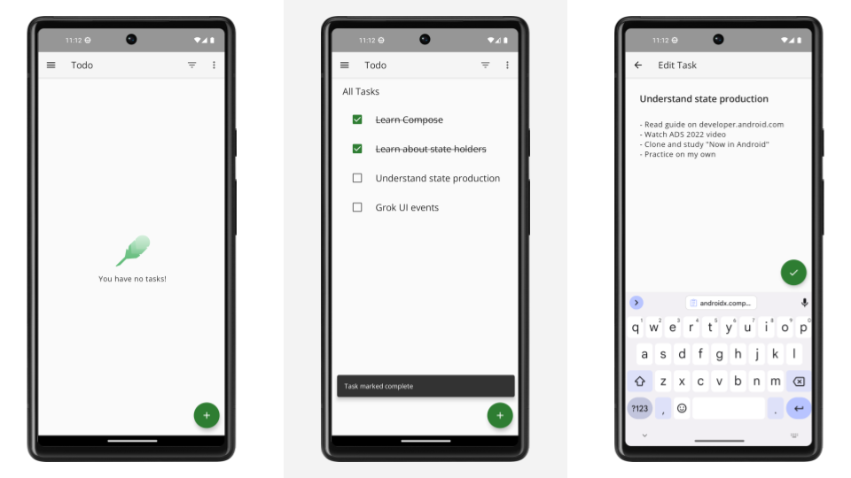

# Android Architecture Samples

These samples showcase different architectural approaches to developing Android apps. In its different branches you'll find the same app (a TODO app) implemented with small differences.

In this branch you'll find:
*   User Interface built with **[Jetpack Compose](https://developer.android.com/jetpack/compose)** 
*   A single-activity architecture, using **[Navigation Compose](https://developer.android.com/jetpack/compose/navigation)**.
*   A presentation layer that contains a Compose screen (View) and a **ViewModel** per screen (or feature).
*   Reactive UIs using **[Flow](https://developer.android.com/kotlin/flow)** and **[coroutines](https://kotlinlang.org/docs/coroutines-overview.html)** for asynchronous operations.
*   A **data layer** with a repository and two data sources (local using Room and a fake remote).
*   Two **product flavors**, `mock` and `prod`, [to ease development and testing](https://android-developers.googleblog.com/2015/12/leveraging-product-flavors-in-android.html).
*   A collection of unit, integration and e2e **tests**, including "shared" tests that can be run on emulator/device.
*   Dependency injection using [Hilt](https://developer.android.com/training/dependency-injection/hilt-android).

## Screenshots



## Why a to-do app?

The app in this project aims to be simple enough that you can understand it quickly, but complex enough to showcase difficult design decisions and testing scenarios. For more information, see the [app's specification](https://github.com/googlesamples/android-architecture/wiki/To-do-app-specification).

## What is it not?
*   A template. Check out the [Architecture Templates](https://github.com/android/architecture-templates) instead.
*   A UI/Material Design sample. The interface of the app is deliberately kept simple to focus on architecture. Check out the [Compose Samples](https://github.com/android/compose-samples) instead.
*   A real production app with network access, user authentication, etc. Check out the [Now in Android app](https://github.com/android/nowinandroid) instead.

## Who is it for?

*   Intermediate developers and beginners looking for a way to structure their app in a testable and maintainable way.
*   Advanced developers looking for quick reference.

## Opening a sample in Android Studio

To open one of the samples in Android Studio, begin by checking out one of the sample branches, and then open the root directory in Android Studio. The following series of steps illustrate how to open the sample.

Clone the repository:

```
git clone git@github.com:android/architecture-samples.git
```

Finally open the `architecture-samples/` directory in Android Studio.

### License


```
Copyright 2024 Google, Inc.

Licensed to the Apache Software Foundation (ASF) under one or more contributor
license agreements. See the NOTICE file distributed with this work for
additional information regarding copyright ownership. The ASF licenses this
file to you under the Apache License, Version 2.0 (the "License"); you may not
use this file except in compliance with the License. You may obtain a copy of
the License at

http://www.apache.org/licenses/LICENSE-2.0

Unless required by applicable law or agreed to in writing, software
distributed under the License is distributed on an "AS IS" BASIS, WITHOUT
WARRANTIES OR CONDITIONS OF ANY KIND, either express or implied. See the
License for the specific language governing permissions and limitations under
the License.
```
